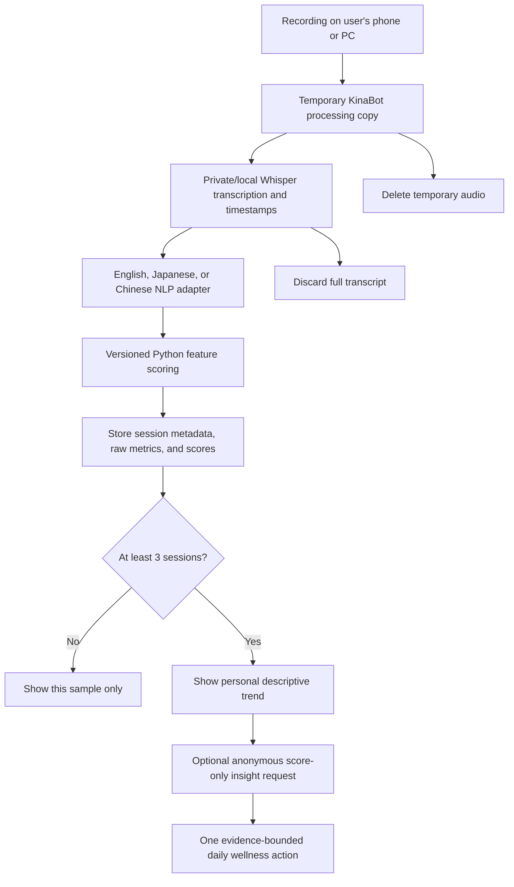

# KinaBot Current Architecture

This document applies only to the Aoi-maintained implementation in
`aoi_kinabot_app/`. Repository-root applications are historical prototypes.

## Data Flow



```text
User's phone or PC
  └─ source recording remains on the user's device
       │ user selects a file
       ▼
KinaBot application
  ├─ temporary audio copy
  ├─ private/local speech-to-text
  ├─ language-specific Python/NLP feature extraction
  ├─ deterministic, versioned feature scoring
  ├─ delete temporary audio and full transcript
  └─ store account, session metadata, raw metrics and scores
       │
       ├─ fewer than 3 sessions → show sample results only
       └─ 3+ sessions → show descriptive personal trend
                          │
                          ▼
Optional OpenAI insight layer
  ├─ receives anonymous score history/deltas only
  ├─ receives no audio, transcript, name or email
  ├─ explains one evidence-informed daily wellness action
  └─ returns no diagnosis, disease risk or cognitive-decline claim
```

## Responsibility Matrix

| Responsibility | Owner |
|---|---|
| Speech-to-text | Private/local transcription engine |
| Pause and voiced-time extraction | KinaBot from local timestamped segments |
| Linguistic and acoustic feature extraction | KinaBot Python/NLP |
| Feature-score calculation | KinaBot versioned scoring engine |
| Personal baseline and trend calculation | KinaBot application |
| Account and session storage | KinaBot database |
| Plain-language daily action | Optional OpenAI insight layer |
| Evidence and safety boundaries | Curated KinaBot research/action library |

OpenAI is not a scoring model and is not the source of truth for user features.

## Multilingual Design

The initial interface supports English, Japanese, and Chinese. Each language
adapter should own:

- word or character segmentation;
- sentence boundary detection;
- language-specific discourse connectors;
- repetition normalization;
- emotional-expression vocabulary;
- pace units and appropriate reference ranges; and
- test fixtures written by fluent speakers.

Every stored score includes a scoring-model version. Cross-language scores
must not be treated as equivalent until adapters are tested and calibrated.

## Longitudinal Insight Rules

One recording produces a sample description, not a conclusion about a person.
Trends unlock only after at least three sessions.

The application may report:

- higher, lower, or similar relative to the user's prior samples;
- how many sessions were compared;
- the comparison time window; and
- whether an observed pattern repeated.

It must not translate a lower feature value into a diagnosis, medical risk,
intelligence estimate, cognitive age, or claim of cognitive decline.

## Actionable Wellness Insight Contract

The optional OpenAI layer receives only:

- interface language;
- anonymous feature identifiers;
- rounded score history or deltas;
- number and date range of sessions; and
- allowed actions and citations from a curated research library.

It returns:

- one small action;
- a start time such as “tomorrow”;
- a realistic duration such as 10 or 20 minutes;
- a suggested frequency;
- a short, non-medical rationale;
- the supporting research citation; and
- a boundary statement.

Example:

> Tomorrow, talk with a friend or family member for 20 minutes. Tell one story
> about your day and ask one follow-up question. Social engagement is a general
> cognitive-wellness habit. This is not a medical assessment and does not mean
> that a health problem exists.

If OpenAI is unavailable, a curated deterministic action library is the safe
fallback.

## Stored and Ephemeral Data

| Data | Retention |
|---|---|
| Source audio on user device | Controlled by user |
| Temporary uploaded audio | Deleted after processing |
| Full transcript | Processed in memory; not persisted |
| Name and email | Stored for account access |
| Consent/profile | Stored and versioned |
| Session metadata | Stored |
| Raw NLP feature metrics | Stored |
| Feature scores and scoring version | Stored |
| Optional habit check-ins | Stored |
| OpenAI input/output | Data-minimized; logs redacted where supported |

Production should encrypt data in transit and at rest, restrict administrative
access, maintain backups and audit logs, and provide account/data deletion.

## Production Direction

```text
Route 53 / stable domain
  → Application Load Balancer (HTTPS)
  → ECS Fargate KinaBot service
  → RDS PostgreSQL
  → Secrets Manager
  → SES email verification
  → CloudWatch logs, metrics and alarms
```

The deployment must use its own service, database, secrets, logs, and backups
and must not overwrite an existing application.
