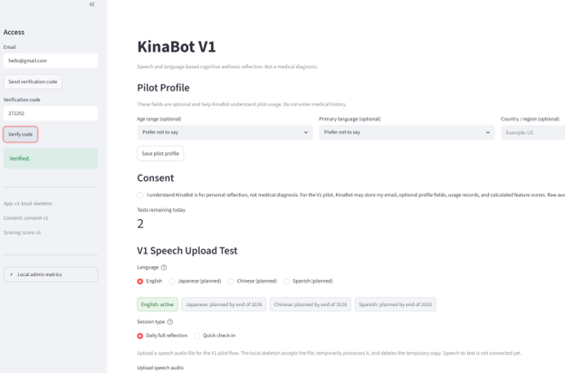

# Aoi-Maintained KinaBot App

This folder is reserved for the new Aoi-maintained KinaBot implementation.

The goal of this implementation is to build a safer, dignity-first, consent-first, and privacy-aware web application for speech reflection and family support.

Earlier prototype work remains in the repository for transparency, but future public-facing development should be organized here with clearer ownership, safety wording, privacy handling, and responsible-use boundaries.

## Development Priorities

- Use communication pattern summaries instead of diagnosis-like language
- Avoid estimated cognitive age or medical risk claims
- Add clear consent notice before recording
- Explain whether audio is saved, deleted, or processed by external services
- Minimize data retention
- Keep reports respectful, non-alarming, and suitable for family discussion

## App UI Image

## Local Audio Upload

The V1 local app accepts speech audio uploads for pilot-flow testing.
Uploaded audio is temporarily written for processing and then deleted immediately.
The local SQLite database stores session metadata and calculated feature scores, not raw audio or transcripts.

Automatic speech-to-text is available when `OPENAI_API_KEY` is configured.
If the key is missing, the local skeleton still accepts manual transcript text after upload.

Optional environment variable:

- `KINABOT_TRANSCRIPTION_MODEL` (`gpt-4o-transcribe` by default)

## Local Email Verification

The local app can send verification codes by email when SMTP settings are configured.
If these settings are missing, the app shows the code on screen for local development.

Required environment variables:

- `KINABOT_SMTP_HOST`
- `KINABOT_SMTP_PORT`
- `KINABOT_SMTP_FROM_EMAIL`

Optional environment variables:

- `KINABOT_SMTP_USERNAME`
- `KINABOT_SMTP_PASSWORD`
- `KINABOT_SMTP_USE_TLS` (`true` by default)

For AWS deployment, these values can be connected to Amazon SES SMTP credentials.
