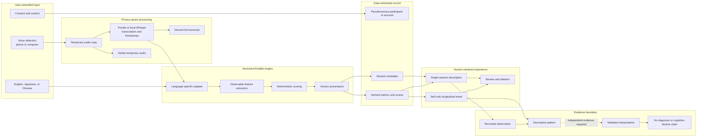
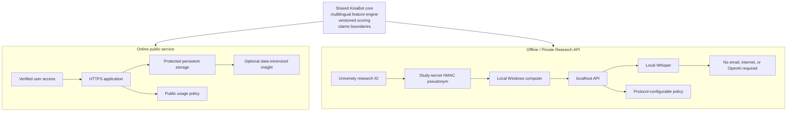

# KinaBot System Architecture

**Scope:** Aoi-maintained `aoi_kinabot_app/`
**Purpose:** Public technical reference for builders, reviewers, and students

KinaBot is a dignity-first, multilingual, privacy-aware system for longitudinal
speech reflection. It describes observable speech and language features; it is
not a diagnostic system.

## Processing and interpretation architecture

The source recording remains under the user's control. KinaBot retains the
minimum derived record required for the selected deployment and exposes the
method and version provenance needed to interpret it responsibly.

## Shared core, different trust boundaries

The offline API is an integration surface for the same versioned engine, not a
second scoring implementation. Deployment changes identity, network, storage,
and governance requirements; it does not change the evidence boundary.

## Responsibility boundary

| Responsibility | System owner |
|---|---|
| Speech-to-text | Approved private/local transcription engine |
| Language processing and feature extraction | KinaBot language adapters |
| Feature-score calculation | Versioned KinaBot scoring engine |
| Personal trend calculation | KinaBot application |
| Optional plain-language action | Data-minimized insight layer or curated fallback |
| Clinical meaning | Not established by the current system |
| Study interpretation | Approved protocol and qualified independent review |

Architecture diagrams document intended boundaries; tests and deployment
records must verify actual behavior. Use the [Benchmark and Evaluation
Framework](../evaluation/BENCHMARK-FRAMEWORK.md) for structured evaluation.
