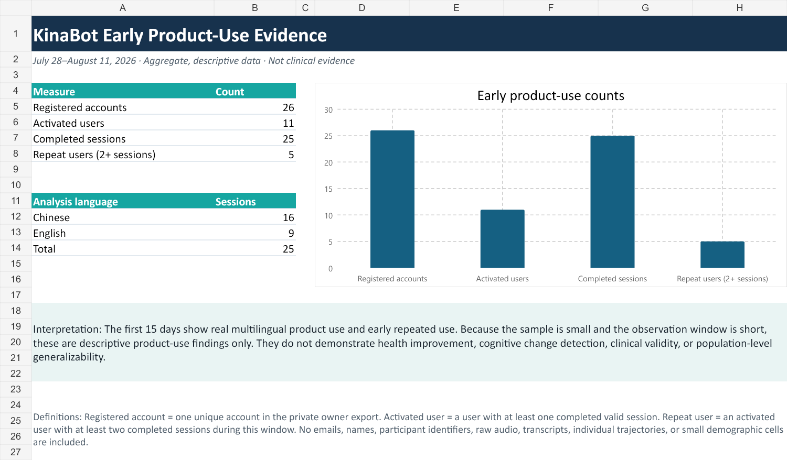

# KinaBot Early Product-Use Report

**Observation window:** July 28–August 11, 2026  
**Report type:** Aggregate, descriptive product-use evidence  
**Product boundary:** KinaBot is non-diagnostic and is not a medical device

## Why This Record Exists

This dated report documents what KinaBot's first production-use data did and
did not show. It preserves honest denominators, privacy boundaries, product
learning, and the next engineering questions without publishing private user
records.

## Aggregate Results

| Measure | Definition | Result |
|---|---|---:|
| Registered accounts | Unique accounts in the private owner export | 26 |
| Activated users | Users with at least one completed valid session | 11 |
| Completed sessions | Unique completed reflection sessions | 25 |
| Repeat users | Activated users with at least two completed sessions during the observation window | 5 |
| Users with 3+ sessions | Activated users with at least three completed sessions during the observation window | 4 |
| Chinese-language sessions | Completed sessions analyzed in Chinese | 16 |
| English-language sessions | Completed sessions analyzed in English | 9 |

The registration-to-activation rate was 42.3% (11/26). Among activated users,
45.5% (5/11) completed at least a second session during this 15-day window.
This is a repeated-use measure for this observation window, not a conventional
7-day or 30-day retention claim.

## What The Evidence Supports

The first 15 days show:

- real use of the deployed multilingual product rather than multilingual
  support existing only as a roadmap statement;
- completed sessions in Chinese and English;
- early repeated use by some activated users; and
- a clear activation opportunity: 15 registered accounts did not have a
  completed session in this export.

These findings support continued product iteration and more structured pilot
measurement.

## What The Evidence Does Not Support

The sample is small, the observation window is short, and the users were not a
representative research cohort. These data therefore do **not** demonstrate:

- health improvement or deterioration;
- detection of cognitive decline;
- clinical validity, diagnostic accuracy, or treatment benefit;
- causal product impact;
- population-level generalizability; or
- conventional retention without a predefined cohort and return window.

KinaBot feature scores are observable, versioned speech and language indexes.
They are intended for self-comparison over time and must not be interpreted as
medical measurements or diagnoses.

## Product Decisions From This Review

1. Instrument the registration-to-first-session funnel with
   privacy-preserving events.
2. Identify whether incomplete activation occurs during verification, consent,
   recording, upload, processing, or first-result comprehension.
3. Define valid-session duration and audio-quality eligibility rules before
   longitudinal comparison.
4. Measure whether users understand the non-diagnostic score boundary.
5. Add a voluntary usefulness and perceived-autonomy measure.
6. Define cohort-based 7-day, 30-day, and 90-day return metrics before making
   retention claims.
7. Evaluate usability and transcription quality by language and device.
8. Normalize country, language, and timezone fields for future aggregate
   reporting.

## Method And Privacy

The private account export supplied the registered-account denominator. The
de-identified research export supplied session, language, duration, version,
and feature records. Each completed session generated eight feature-level
rows, so 200 research rows represented 25 sessions rather than 200 uses.

No private source export is included here. This report excludes:

- email addresses and display names;
- participant identifiers;
- raw audio and full transcripts;
- individual longitudinal trajectories;
- raw feature-level records; and
- small demographic cells or combinations that could increase
  re-identification risk.

The private dated source snapshot and calculation workbook are retained
separately under restricted owner access. Public numbers must be recalculated
from a dated source snapshot and reviewed before any future update.

## Evidence Status

This is first-party product-use evidence maintained by Aoi Minamoto / AImoji
LLC. It is useful for documenting product development, measurement discipline,
and early use. Independent adoption, external validation, research outcomes,
and clinical evidence require separate records and must not be inferred from
this report.
